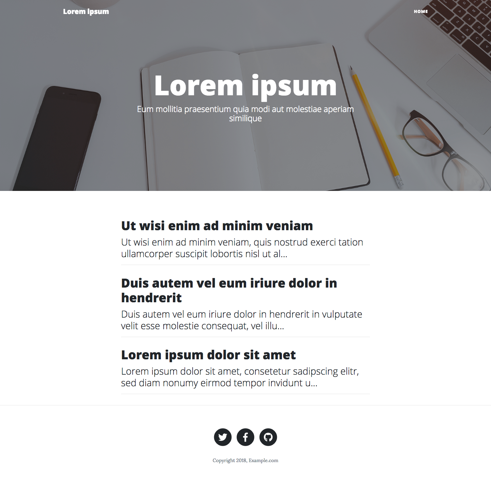
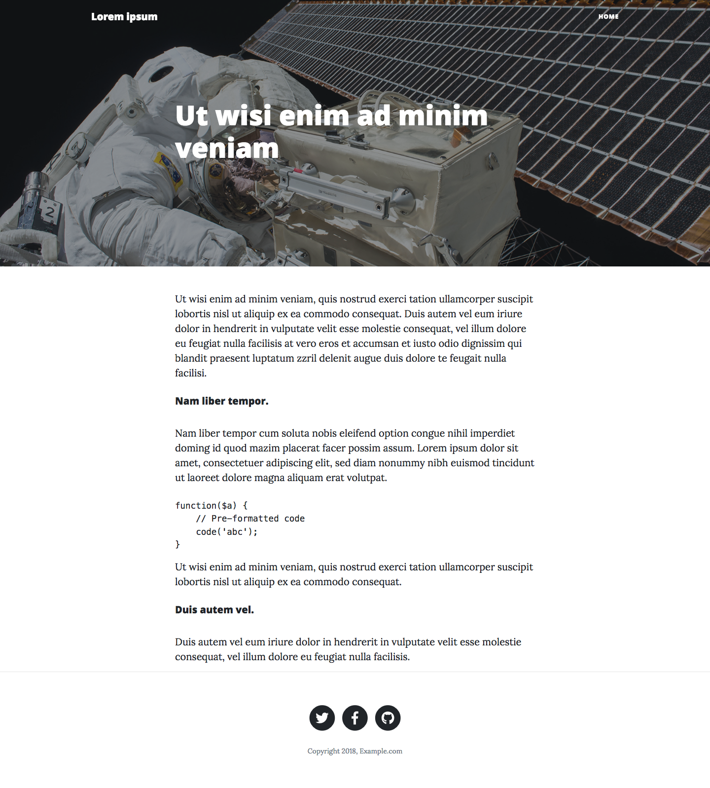

# CleanBlog theme for Journal
[CleanBlog](https://startbootstrap.com/template-overviews/clean-blog/) theme for [Journal](https://github.com/vantezzen/journal).

# Installation
1. [Download this repository](https://github.com/vantezzen/journal-cleanblog/archive/master.zip)
2. In your Journal `themes/` folder, create a new `clean_blog` folder
3. Copy the repository contents into the `themes/clean_blog/` folder
4. Go to Journals' settings, under "Theme" choose "clean_blog"
5. Save settings - Your blog should now be in the CleanBlog theme

# Source
Most of this projects' source code originates form the [Bootstrap Theme Clean Blog](https://startbootstrap.com/template-overviews/clean-blog/). It has been modified to work with Journal.

# Screenshots

# Customization
You can customize CleanBlog by exiting its source files, located in your `themes/clean_blog/` folder.
### Custom social media links
Open `themes/clean_blog/base.blade.php`, scroll down to line 62, replace `https://twitter.com/username` with your twitter url, scroll to line 70 and replace `https://facebook.com/username` with your Facebook url.
### Custom images
All images are located inside `themes/clean_blog/assets/img/`. `home-bg.jpg` will be shown on the homepage, `post-bg.jpg` on the post page.